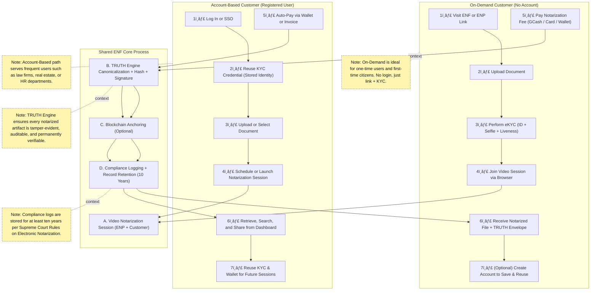

# 🧭 Customer Journey Map – On-Demand vs Account-Based Flow
## Electronic Notarization Facility (ENF) powered by TRUTH Engine and HyperVerge eKYC

```mermaid
flowchart TB

%% ==============================
%% Swimlanes / Subgraphs
%% ==============================
subgraph OD["On-Demand Customer (No Account)"]
direction TB
OD1["1ï¸âƒ£ Visit ENF or ENP Link"]
OD2["2ï¸âƒ£ Upload Document"]
OD3["3ï¸âƒ£ Perform eKYC (ID + Selfie + Liveness)"]
OD4["4ï¸âƒ£ Join Video Session via Browser"]
OD5["5ï¸âƒ£ Pay Notarization Fee (GCash / Card / Wallet)"]
OD6["6ï¸âƒ£ Receive Notarized File + TRUTH Envelope"]
OD7["7ï¸âƒ£ (Optional) Create Account to Save & Reuse"]
end

subgraph ACC["Account-Based Customer (Registered User)"]
direction TB
AC1["1ï¸âƒ£ Log In or SSO"]
AC2["2ï¸âƒ£ Reuse KYC Credential (Stored Identity)"]
AC3["3ï¸âƒ£ Upload or Select Document"]
AC4["4ï¸âƒ£ Schedule or Launch Notarization Session"]
AC5["5ï¸âƒ£ Auto-Pay via Wallet or Invoice"]
AC6["6ï¸âƒ£ Retrieve, Search, and Share from Dashboard"]
AC7["7ï¸âƒ£ Reuse KYC & Wallet for Future Sessions"]
end

%% ==============================
%% Shared / Common Process
%% ==============================
subgraph CORE["Shared ENF Core Process"]
direction TB
C1["A. Video Notarization Session (ENP + Customer)"]
C2["B. TRUTH Engine Canonicalization + Hash + Signature"]
C3["C. Blockchain Anchoring (Optional)"]
C4["D. Compliance Logging + Record Retention (10 Years)"]
end

%% ==============================
%% Connect On-Demand Flow to Core
%% ==============================
OD1 --> OD2 --> OD3 --> OD4 --> C1
OD5 --> C2
C2 --> C3 --> C4
C4 --> OD6 --> OD7

%% ==============================
%% Connect Account-Based Flow to Core
%% ==============================
AC1 --> AC2 --> AC3 --> AC4 --> C1
AC5 --> C2
C2 --> C3 --> C4
C4 --> AC6 --> AC7

%% ==============================
%% Visual Notes (Summaries)
%% ==============================
N1[Note: On-Demand is ideal for one-time users and first-time citizens. No login, just link + KYC.]
OD -. context .- N1

N2[Note: Account-Based path serves frequent users such as law firms, real estate, or HR departments.]
ACC -. context .- N2

N3[Note: TRUTH Engine ensures every notarized artifact is tamper-evident, auditable, and permanently verifiable.]
C2 -. context .- N3

N4[Note: Compliance logs are stored for at least ten years per Supreme Court Rules on Electronic Notarization.]
C4 -. context .- N4

%% ==============================
%% Note Styling
%% ==============================
classDef note fill:#fff5b1,stroke:#555,stroke-dasharray:3 3,color:#111;
class N1,N2,N3,N4 note;
```
