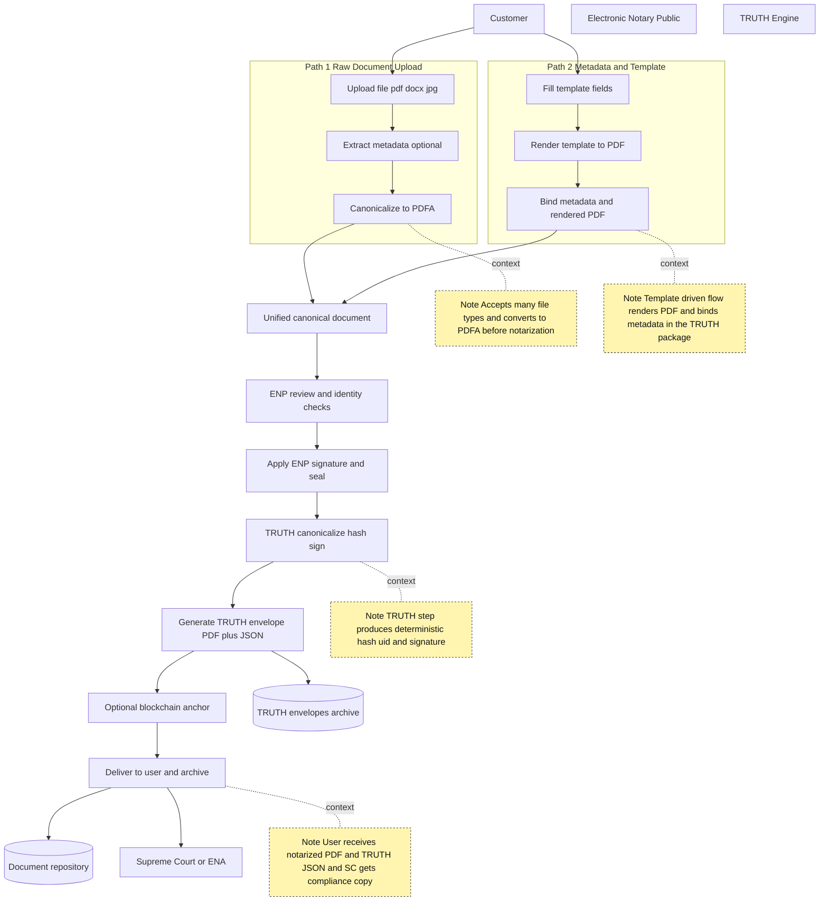

# Dual-Path Canonicalization and Notarization Flow
## Electronic Notarization Facility (ENF)

```mermaid
flowchart TB

%% External actors
User[Customer]
ENP[Electronic Notary Public]
TRUTH[TRUTH Engine]
SC[Supreme Court or ENA]

%% Path 1: Raw upload
subgraph P1["Path 1 Raw Document Upload"]
direction TB
U1["Upload file pdf docx jpg"]
U2["Extract metadata optional"]
U3["Canonicalize to PDFA"]
end

%% Path 2: Template plus metadata
subgraph P2["Path 2 Metadata and Template"]
direction TB
M1["Fill template fields"]
M2["Render template to PDF"]
M3["Bind metadata and rendered PDF"]
end

%% Merge and core processing
Merge["Unified canonical document"]

N1["ENP review and identity checks"]
N2["Apply ENP signature and seal"]
N3["TRUTH canonicalize hash sign"]
N4["Generate TRUTH envelope PDF plus JSON"]
N5["Optional blockchain anchor"]
N6["Deliver to user and archive"]

%% Data stores
D1[(Document repository)]
D2[(TRUTH envelopes archive)]

%% Flows
User --> U1
U1 --> U2 --> U3 --> Merge
User --> M1 --> M2 --> M3 --> Merge

Merge --> N1 --> N2 --> N3 --> N4 --> N5 --> N6
N6 --> D1
N4 --> D2
N6 --> SC

%% Annotations (use dotted connectors)
A1[Note Accepts many file types and converts to PDFA before notarization]
U3 -. context .- A1

A2[Note Template driven flow renders PDF and binds metadata in the TRUTH package]
M3 -. context .- A2

A3[Note TRUTH step produces deterministic hash uid and signature]
N3 -. context .- A3

A4[Note User receives notarized PDF and TRUTH JSON and SC gets compliance copy]
N6 -. context .- A4

%% Styling for annotation nodes
classDef note fill:#fff5b1,stroke:#333,stroke-dasharray:3 3,color:#111;
class A1,A2,A3,A4 note;
```
