#Landing Page

  <h2 style="font-size: 2.5rem; font-weight: 300; color: #1a1a2e;">Notra</h2>
  

    Signed and sealed — on your terms.
  

---

## Built For

**Law Offices** • **Lawyers** • **Corporations** • **SMEs** • **Individuals**

[See the full customer journey →](regulations/CUSTOMER_JOURNEY_MAP.md)

---

## How It Works

```mermaid
flowchart LR
    A[📄 Upload] --> B[✍️ Sign]
B --> C[📅 Book]
C --> D[📹 Show Up]
D --> E[✅ Finish]

style A fill:#e3f2fd
style B fill:#e3f2fd
style C fill:#e3f2fd
style D fill:#e3f2fd
style E fill:#bbdefb
```

1. **Upload** your PDF document
2. **Sign** it digitally
3. **Book** a video session
4. **Show up** for the notary call
5. **Notarize** with your notarized copy

---

## Why Notra?

**No commute. No lines. No waiting.**

- ✅ Supreme Court–compliant digital notarization
- ✅ 100% cloud-based — no downloads or paperwork
- ✅ Built-in identity checks with secure eKYC
- ✅ Powered by the Truth Engine™ for auditability and trust
- ✅ Integrated with your Digital Wallet for faster transactions

---

  
© 2025 Notra. All rights reserved.

  
3neti Research & Development OPC

