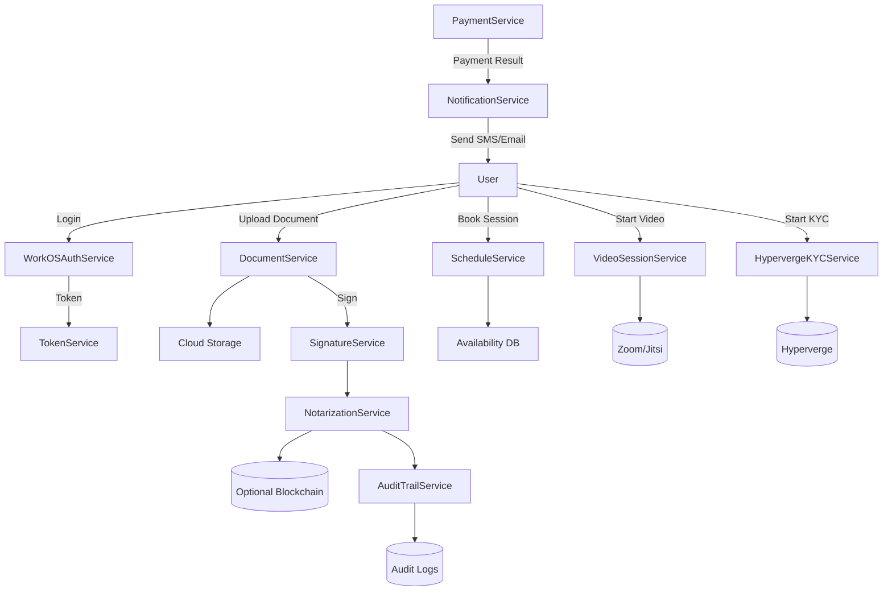
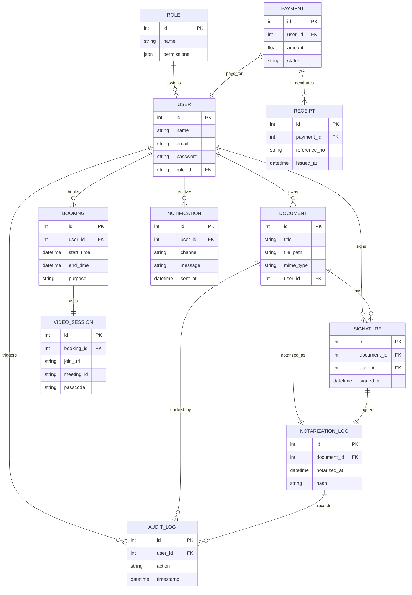

# ENF Interfaces and DTO Definitions

This document defines the key interfaces and Data Transfer Objects (DTOs) used across the Notra backend services.

---

## 📊 System Overview

### 📈 Data Flow Diagram (DFD - Level 1)



---

### 🗃️ Entity Relationship Diagram (ERD)



---

## 🔐 Authentication

### Interface: WorkOSAuthServiceInterface
```php
interface WorkOSAuthServiceInterface {
    public function redirectToProvider(): string;
    public function handleCallback(array $request): User;
}
```

### DTO: AuthenticatedUserData
```php
class AuthenticatedUserData {
    public string $id;
    public string $email;
    public string $name;
    public array $roles;
    public string $token;
}
```

---

## 👤 User & Role Management

### Interface: UserServiceInterface
```php
interface UserServiceInterface {
    public function createUser(UserData $data): User;
    public function assignRole(User $user, string $role): void;
}
```

### DTO: UserData
```php
class UserData {
    public string $name;
    public string $email;
    public string $password;
}
```

### DTO: RoleData
```php
class RoleData {
    public string $name;
    public array $permissions;
}
```

---

## 📄 Document Handling

### Interface: DocumentServiceInterface
```php
interface DocumentServiceInterface {
    public function upload(DocumentData $data): Document;
    public function sign(Document $document, User $signer): Signature;
}
```

### DTO: DocumentData
```php
class DocumentData {
    public string $title;
    public string $filename;
    public string $mimeType;
    public string $contentBase64;
}
```

### DTO: SignatureData
```php
class SignatureData {
    public int $documentId;
    public int $userId;
    public string $signedAt;
}
```

---

## 🗓️ Booking & Scheduling

### Interface: ScheduleServiceInterface
```php
interface ScheduleServiceInterface {
    public function book(BookingData $data): Booking;
    public function checkAvailability(string $date): array;
}
```

### DTO: ScheduleSlotData
```php
class ScheduleSlotData {
    public string $startTime;
    public string $endTime;
    public bool $isAvailable;
}
```

### DTO: BookingData
```php
class BookingData {
    public int $userId;
    public string $slot;
    public string $purpose;
}
```

---

## 📹 Video Session

### Interface: VideoSessionServiceInterface
```php
interface VideoSessionServiceInterface {
    public function createSession(array $participants): VideoSessionData;
}
```

### DTO: VideoSessionData
```php
class VideoSessionData {
    public string $meetingId;
    public string $joinUrl;
    public string $passcode;
}
```

---

## 🧍‍♂️ eKYC & Identity Verification

### Interface: HypervergeKYCServiceInterface
```php
interface HypervergeKYCServiceInterface {
    public function startKYC(array $userData): KYCResultData;
    public function verifySelfie(string $base64Image): SelfieData;
}
```

### DTO: KYCResultData
```php
class KYCResultData {
    public string $applicationStatus;
    public array $fieldsExtracted;
}
```

### DTO: SelfieData
```php
class SelfieData {
    public string $imageUrl;
    public bool $isLive;
}
```

---

## ✍️ Notarization

### Interface: NotarizationServiceInterface
```php
interface NotarizationServiceInterface {
    public function notarize(Document $document): NotarizationLogData;
}
```

### DTO: NotarizationLogData
```php
class NotarizationLogData {
    public int $documentId;
    public string $notarizedAt;
    public string $hash;
}
```

---

## 📚 Audit Trail

### Interface: AuditTrailServiceInterface
```php
interface AuditTrailServiceInterface {
    public function logAction(string $action, array $metadata): void;
}
```

### DTO: AuditEntryData
```php
class AuditEntryData {
    public string $action;
    public int $userId;
    public string $timestamp;
    public array $details;
}
```

---

## 💳 Payment Gateway

### Interface: PaymentServiceInterface
```php
interface PaymentServiceInterface {
    public function initiate(PaymentIntentData $data): string;
    public function confirm(string $transactionId): ReceiptData;
}
```

### DTO: PaymentIntentData
```php
class PaymentIntentData {
    public float $amount;
    public string $currency;
    public string $description;
}
```

### DTO: ReceiptData
```php
class ReceiptData {
    public string $transactionId;
    public string $status;
    public string $issuedAt;
}
```

---

## 🔔 Notifications

### Interface: NotificationServiceInterface
```php
interface NotificationServiceInterface {
    public function send(NotificationData $data): void;
}
```

### DTO: NotificationData
```php
class NotificationData {
    public int $userId;
    public string $channel; // 'email', 'sms', etc.
    public string $message;
}
```

---

## 📋 Usage Notes

- All DTOs should implement validation logic in their constructors
- Interfaces should be bound to concrete implementations via Laravel's service container
- Use type hints and return types for better IDE support and type safety
- DTOs are immutable by default; use builder patterns for complex modifications
