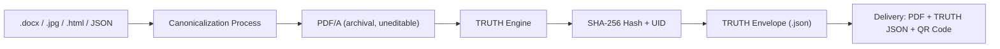

# 🔐 Canonicalization and PDF/A Explained
## For Electronic Notarization Facilities (ENF) powered by the TRUTH Engine

---

## 🧩 1️⃣ What “Canonicalize” Means in IT

### 💡 Definition
> **Canonicalization** (or *to canonicalize*) means converting data into a **standard, consistent, and unambiguous format** so it can be safely compared, hashed, or verified.

It is a process of *normalizing* — removing differences that do not affect meaning but may change representation.

### 💻 Examples

| Context | Input | Canonicalized Output | Purpose |
|----------|--------|----------------------|----------|
| URLs | `HTTP://Example.com/../index.html` | `https://example.com/index.html` | Avoid duplicates and exploits |
| JSON | `{ "b":1, "a":2 }` | `{ "a":2, "b":1 }` | Consistent hashing |
| XML | Tags with spaces or random order | Ordered, trimmed tags | Validation and signing |
| Documents | `.docx` with variable fonts and macros | `.pdfa` flattened | Immutable for signing |

In short: **canonicalization** ensures that *everyone sees the same document* and can compute *the same hash*.

---

## 📘 2️⃣ What is PDF/A?

### 📜 PDF vs PDF/A

| Feature | PDF | PDF/A |
|----------|-----|-------|
| Editable | Yes | No (fixed) |
| Fonts | Can link external fonts | Must embed all fonts |
| Colors | Device-dependent | Fixed color profiles (ICC) |
| Metadata | Optional | Mandatory XMP metadata |
| Media | May include scripts, audio | Prohibited |
| Longevity | Not guaranteed | ISO 19005 Archival standard |
| Legal admissibility | Questionable | High — accepted for e-signing & archiving |

**PDF/A** is a **subset of PDF** defined by **ISO 19005**, designed to preserve the visual and structural integrity of documents for long-term storage.  
It’s widely used in government, banking, and courts for **archival and notarized documents**.

---

## 🧾 3️⃣ Why ENFs Must Canonicalize to PDF/A

The **Rules on Electronic Notarization (A.M. No. 24-10-14-SC)** require that notarized electronic documents must be:

- **Fixed and unalterable**
- **Capable of faithful reproduction**
- **Securely retained for at least 10 years**

By canonicalizing all uploads into **PDF/A**, the ENF ensures that:
- Files are **bit-stable** (identical byte-for-byte across devices)
- Fonts, colors, and layouts are embedded and immutable
- The file is **ready for digital signing and hashing** by the TRUTH Engine

---

## ⚙️ 4️⃣ Canonicalization in the TRUTH Engine Workflow

When the ENF pipeline says:
> “Canonicalize to PDF/A”

It performs the following:

1. **Accept Input**: `.pdf`, `.docx`, `.jpg`, `.html`, or structured metadata.
2. **Normalize Content**: Strip variable or non-deterministic data (timestamps, embedded macros, random IDs).
3. **Render to PDF/A**: Convert all inputs to fixed-layout archival PDF.
4. **Compute Hash**: Generate a deterministic cryptographic hash (e.g., SHA-256).
5. **Sign and Seal**: TRUTH Engine binds this hash to the notarization record.

---

## 🧮 5️⃣ Visual Flow Diagram

---

## 🔐 6️⃣ Why Canonicalization Matters

| Benefit | Description |
|----------|--------------|
| **Integrity** | The hash of the file is always identical — no ambiguity. |
| **Interoperability** | PDF/A renders identically on all compliant viewers. |
| **Auditability** | Can be verified decades later without original software. |
| **Legal robustness** | Courts and archives trust PDF/A as immutable evidence. |
| **Blockchain readiness** | Canonicalized files can be hashed and anchored on-chain. |

---

## 🧠 7️⃣ TRUTH Engine + PDF/A: Perfect Pair

The TRUTH Engine relies on **canonicalization** to make notarized documents **verifiable forever**.
- The PDF/A ensures *visual consistency*.
- The TRUTH Envelope ensures *cryptographic integrity*.  
  Together, they make the notarization both **human-readable** and **machine-verifiable**.

---

### ✅ Key Takeaway

> **Canonicalization → PDF/A → TRUTH Envelope**  
> A pipeline ensuring every notarized document is standardized, immutable, and permanently verifiable.

---

**End of Document**
