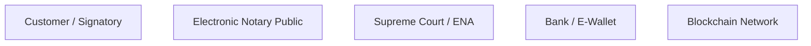
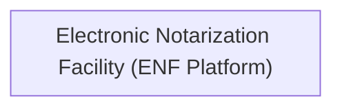
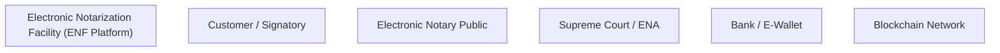
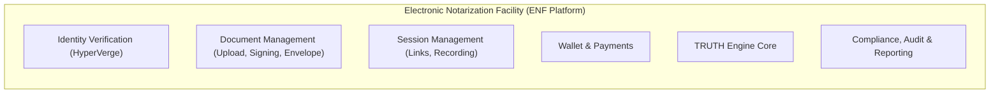
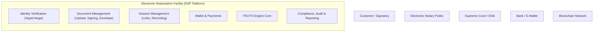
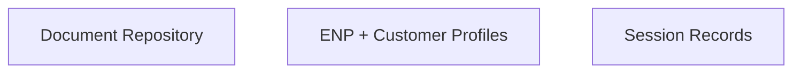
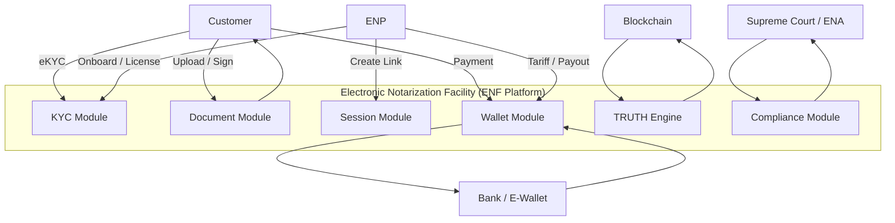
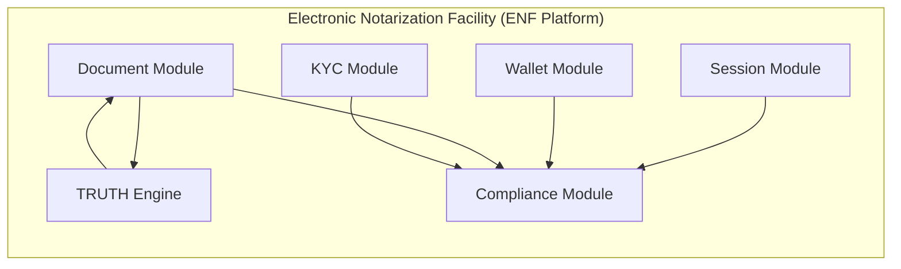
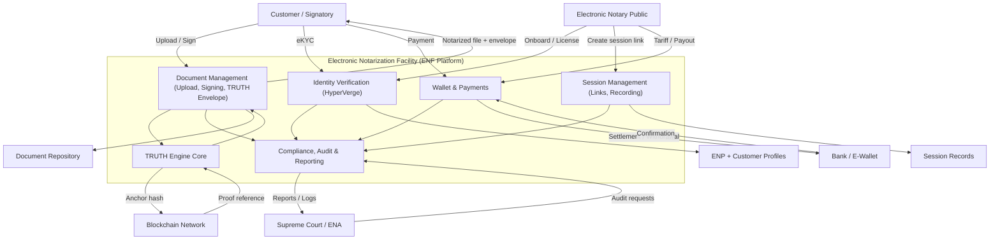

# 🧩 DFD Level 1 — Detailed Data Flow Diagram
## Electronic Notarization Facility (ENF)
### Powered by TRUTH Engine, HyperVerge eKYC, and Blockchain Anchoring

```mermaid
flowchart TB
    Customer[Customer / Signatory]
    ENP[Electronic Notary Public]
    SC[Supreme Court / ENA]
    Bank[Bank / E-Wallet]
    Chain[Blockchain Network]
```

```mermaid
    flowchart TB
    subgraph ENF_System["Electronic Notarization Facility (ENF Platform)"]
    end
```

```mermaid
flowchart TB
Customer[Customer / Signatory]
ENP[Electronic Notary Public]
SC[Supreme Court / ENA]
Bank[Bank / E-Wallet]
Chain[Blockchain Network]

subgraph ENF_System["Electronic Notarization Facility (ENF Platform)"]
end
```

```mermaid
flowchart TB
subgraph ENF_System["Electronic Notarization Facility (ENF Platform)"]
direction TB
KYC["Identity Verification (HyperVerge)"]
DOCS["Document Management (Upload, Signing, Envelope)"]
SESSION["Session Management (Links, Recording)"]
WALLET["Wallet & Payments"]
TRUTH["TRUTH Engine Core"]
COMP["Compliance, Audit & Reporting"]
end
```

```mermaid
flowchart TB
Customer[Customer / Signatory]
ENP[Electronic Notary Public]
SC[Supreme Court / ENA]
Bank[Bank / E-Wallet]
Chain[Blockchain Network]

subgraph ENF_System["Electronic Notarization Facility (ENF Platform)"]
direction TB
KYC["Identity Verification (HyperVerge)"]
DOCS["Document Management (Upload, Signing, Envelope)"]
SESSION["Session Management (Links, Recording)"]
WALLET["Wallet & Payments"]
TRUTH["TRUTH Engine Core"]
COMP["Compliance, Audit & Reporting"]
end
```

```mermaid
flowchart TB
DocsRepo[Document Repository]
Profiles[ENP + Customer Profiles]
Sessions[Session Records]
```

```mermaid
flowchart TB
Customer[Customer]
ENP[ENP]
SC[Supreme Court / ENA]
Bank[Bank / E-Wallet]
Chain[Blockchain]

subgraph ENF_System["Electronic Notarization Facility (ENF Platform)"]
direction TB
KYC["KYC Module"]
DOCS["Document Module"]
SESSION["Session Module"]
WALLET["Wallet Module"]
TRUTH["TRUTH Engine"]
COMP["Compliance Module"]
end

Customer -->|Upload / Sign| DOCS
Customer -->|eKYC| KYC
Customer -->|Payment| WALLET
DOCS --> Customer

ENP -->|Onboard / License| KYC
ENP -->|Create Link| SESSION
ENP -->|Tariff / Payout| WALLET

COMP --> SC
SC --> COMP

WALLET --> Bank
Bank --> WALLET

TRUTH --> Chain
Chain --> TRUTH
```

```mermaid
flowchart TB
subgraph ENF_System["Electronic Notarization Facility (ENF Platform)"]
direction TB
KYC["KYC Module"]
DOCS["Document Module"]
SESSION["Session Module"]
WALLET["Wallet Module"]
TRUTH["TRUTH Engine"]
COMP["Compliance Module"]

DOCS --> TRUTH
TRUTH --> DOCS
SESSION --> COMP
WALLET --> COMP
DOCS --> COMP
KYC --> COMP
end
```

```mermaid
flowchart TB

Customer[Customer / Signatory]
ENP[Electronic Notary Public]
SC[Supreme Court / ENA]
Bank[Bank / E-Wallet]
Chain[Blockchain Network]

DocsRepo[Document Repository]
Profiles[ENP + Customer Profiles]
Sessions[Session Records]

subgraph ENF_System["Electronic Notarization Facility (ENF Platform)"]
direction TB
KYC["Identity Verification (HyperVerge)"]
DOCS["Document Management (Upload, Signing, TRUTH Envelope)"]
SESSION["Session Management (Links, Recording)"]
WALLET["Wallet & Payments"]
TRUTH["TRUTH Engine Core"]
COMP["Compliance, Audit & Reporting"]

DOCS --> TRUTH
TRUTH --> DOCS
SESSION --> COMP
WALLET --> COMP
DOCS --> COMP
KYC --> COMP
end

Customer -->|Upload / Sign| DOCS
Customer -->|eKYC| KYC
Customer -->|Payment| WALLET
DOCS -->|Notarized file + envelope| Customer

ENP -->|Onboard / License| KYC
ENP -->|Create session link| SESSION
ENP -->|Tariff / Payout| WALLET

COMP -->|Reports / Logs| SC
SC -->|Audit requests| COMP

WALLET -->|Settlement / Withdrawal| Bank
Bank -->|Confirmation| WALLET

TRUTH -->|Anchor hash| Chain
Chain -->|Proof reference| TRUTH

DOCS --> DocsRepo
KYC --> Profiles
SESSION --> Sessions
```
