# 🔐 DFD Level 2 — TRUTH Engine Core
## Subsystem of the Electronic Notarization Facility (ENF)
### Processes → Canonicalization → Hashing → UID → Signature → Blockchain Anchoring

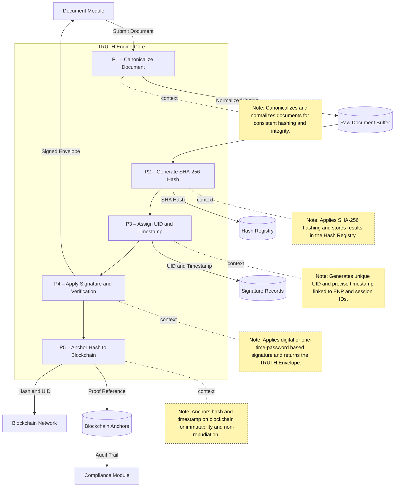
---

### 🧠 Diagram Interpretation

| Stage | Function | Output / Storage |
|--------|-----------|------------------|
| **P1** | Canonicalizes uploaded file into deterministic JSON | Raw Document Buffer |
| **P2** | Computes cryptographic hash (SHA-256 / SHA-3) | Hash Registry |
| **P3** | Generates globally unique UID and timestamp | Signature Records |
| **P4** | Applies digital or OTP-based signature, returns TRUTH Envelope | Document Module |
| **P5** | Anchors hash and UID on Blockchain and logs proof | Blockchain Anchors → Compliance |

---

# 🪪 DFD Level 2 — KYC (Identity Verification) Module
## Subsystem of the Electronic Notarization Facility (ENF)
### Process Flow → ID Capture → OCR → Face Match → Liveness → Verification Envelope

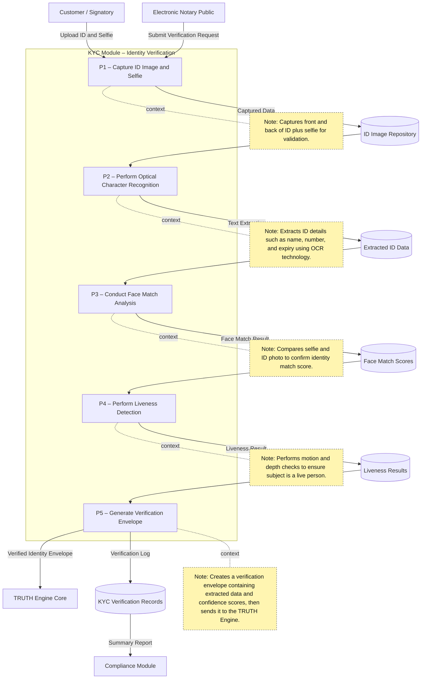
---

### 🧠 Interpretation

| Step | Function | Output / Store |
|------|-----------|----------------|
| **P1** | Captures ID images and selfie | ID Image Repository |
| **P2** | Extracts text and fields via OCR | Extracted ID Data |
| **P3** | Compares selfie vs ID photo | Face Match Scores |
| **P4** | Runs liveness detection | Liveness Results |
| **P5** | Packages verified identity + confidence data | Verification Envelope → TRUTH Engine |

---

Would you like me to proceed with **DFD Level 2 – Wallet and Payment Module** next (showing top-up → transaction → settlement → ledger update)?

# 💰 DFD Level 2 — Wallet and Payment Module
## Subsystem of the Electronic Notarization Facility (ENF)
### Process Flow → Top-up → Transaction → Settlement → Ledger Update → Reporting

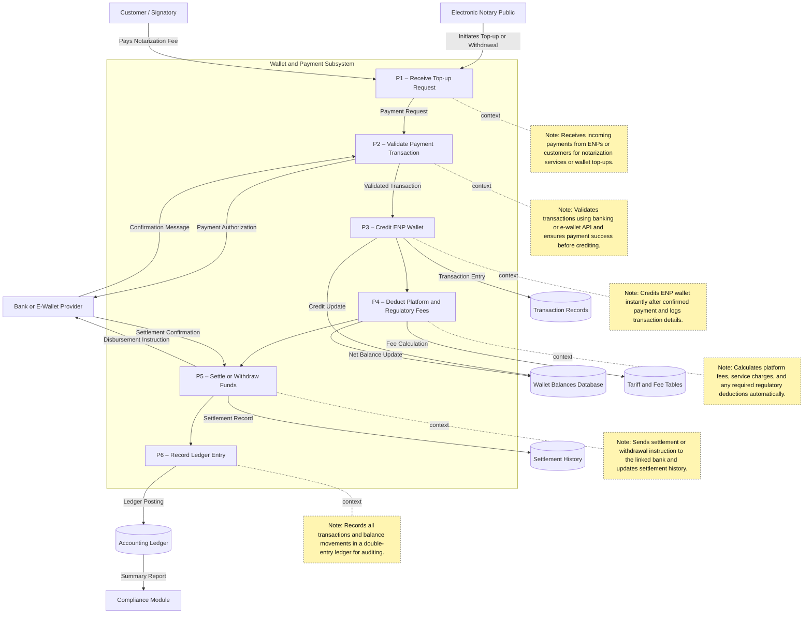
---

### 🧠 Interpretation

| Step | Function | Output / Store |
|------|-----------|----------------|
| **P1** | Receives top-up or payment request | Payment Request |
| **P2** | Validates via bank or e-wallet provider | Transaction Records |
| **P3** | Credits ENP wallet after confirmation | Wallet Balances Database |
| **P4** | Deducts platform and regulatory fees | Fee Tables / Wallet Updates |
| **P5** | Settles or withdraws funds to bank | Settlement History |
| **P6** | Records ledger entry for audit and compliance | Accounting Ledger |

---

Would you like me to proceed with **DFD Level 2 — Compliance, Audit, and Reporting Module** next (showing log aggregation → audit trail → SC report generation → ENA API access)?

# 📊 DFD Level 2 — Compliance, Audit, and Reporting Module
## Subsystem of the Electronic Notarization Facility (ENF)
### Process Flow → Collect Logs → Aggregate Data → Generate Reports → Submit to Supreme Court

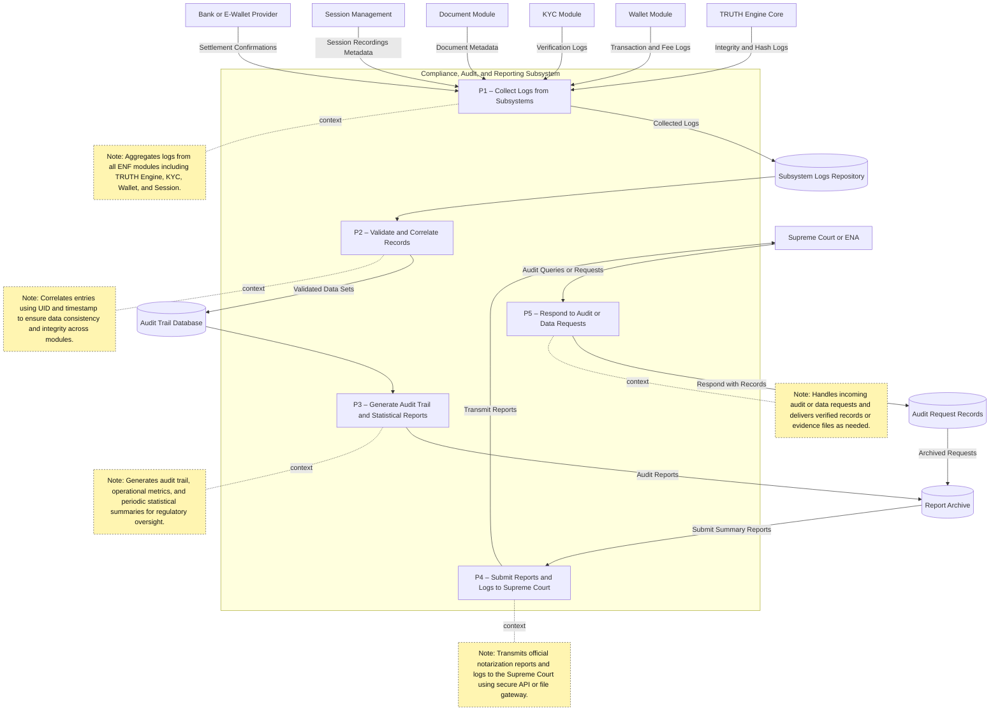
---

### 🧠 Interpretation

| Step | Function | Output / Store |
|------|-----------|----------------|
| **P1** | Collects logs from all subsystems (TRUTH, KYC, Wallet, Sessions, etc.) | Subsystem Logs Repository |
| **P2** | Validates, correlates, and normalizes logs | Audit Trail Database |
| **P3** | Produces audit trail and statistical or compliance reports | Report Archive |
| **P4** | Submits reports and logs to the Supreme Court / ENA | Transmission to SC |
| **P5** | Responds to audit queries and provides verified evidence | Request Records Archive |

---

### ✅ Characteristics
- Supreme Court and ENA integration shown explicitly.
- Each subsystem (TRUTH, KYC, Wallet, Session, Bank) is a **log source**.
- Data lifecycle: *Logs → Validation → Audit Trail → Report → Transmission → Request Response*.
- No disallowed symbols; confirmed Mermaid-compliant syntax.

---

# 📄 DFD Level 2 — Document and Session Management Module
## Subsystem of the Electronic Notarization Facility (ENF)
### Process Flow → Upload Document → Prepare Metadata → Create Notarization Session → Record Interaction → Bind TRUTH Envelope → Archive

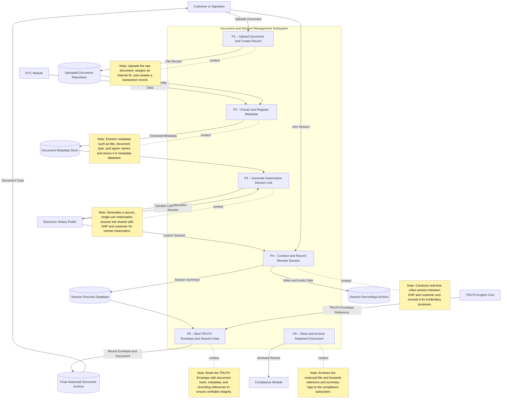
---

### 🧠 Interpretation

| Step | Function | Output / Storage |
|------|-----------|------------------|
| **P1** | Uploads original document and registers upload transaction | Uploaded Document Repository |
| **P2** | Extracts and registers metadata for identification and indexing | Document Metadata Store |
| **P3** | Generates secure session link (Zoom-like) for remote notarization | Session Records Database |
| **P4** | Conducts and records live session between ENP and customer | Session Recordings Archive |
| **P5** | Binds TRUTH Envelope to the notarized document and session logs | Final Notarized Document Archive |
| **P6** | Archives document and forwards logs to Compliance for oversight | Compliance Module |

---

# 🧾 DFD Level 2 — ENP Onboarding and Tariff Management Module
## Subsystem of the Electronic Notarization Facility (ENF)
### Process Flow → Registration → Credential Verification → Profile Creation → Tariff Setup → Wallet Link → Activation

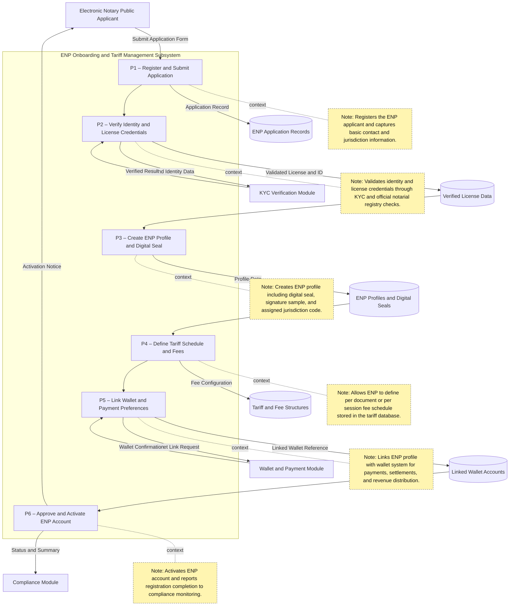

---
### 🧠 Interpretation

| Step | Function | Output / Store |
|------|-----------|----------------|
| **P1** | Accepts registration data and creates application record | ENP Application Records |
| **P2** | Validates identity and notarial license credentials | Verified License Data |
| **P3** | Generates ENP profile and digital seal | ENP Profiles and Seals |
| **P4** | Allows tariff and fee configuration | Tariff and Fee Structures |
| **P5** | Links ENP wallet for transactions | Linked Wallet Accounts |
| **P6** | Activates ENP account and reports to Compliance | Compliance Module |

---

### ✅ Highlights
- Integrates tightly with **KYC** and **Wallet** subsystems for trust and financial control.
- Automates end-to-end onboarding from registration through activation.
- Maintains transparent linkage among license verification, tariff data, and wallet settlement.
- Syntax-safe, renders cleanly in VS Code, GitHub, Obsidian, and Mermaid Live Editor.

---
# 👤 DFD Level 2 — Customer Portal and Document Management Interface
## Subsystem of the Electronic Notarization Facility (ENF)
### Process Flow → Account Creation → KYC Reuse → Upload → Sign → Verify → Retrieve

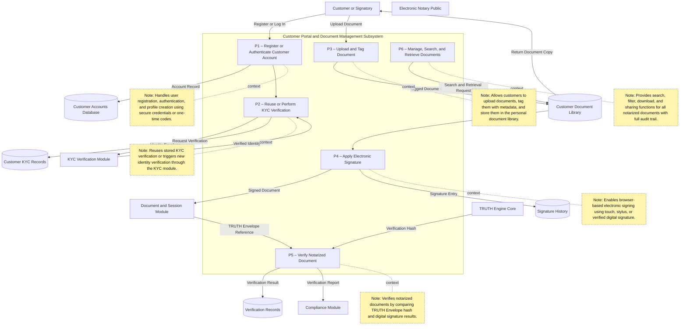
---

### 🧠 Interpretation

| Step | Function | Output / Storage |
|------|-----------|------------------|
| **P1** | Customer registration or login | Customer Accounts Database |
| **P2** | Performs or reuses KYC verification | Customer KYC Records |
| **P3** | Uploads and tags documents | Customer Document Library |
| **P4** | Applies electronic signature | Signature History |
| **P5** | Verifies TRUTH envelope and signatures | Verification Records |
| **P6** | Retrieves and manages documents for download or sharing | Customer Document Library |

---

### ✅ Highlights
- Integrates directly with KYC, TRUTH Engine, and Document Session modules.
- Customer can verify and retrieve documents without installing additional apps.
- All records are cross-referenced with Compliance for auditability.
- Syntax-safe and renderable in VS Code, GitHub, and Mermaid Live Editor.

---
# ⛓️ DFD Level 2 — Blockchain Anchoring Service
## Subsystem of the Electronic Notarization Facility (ENF)
### Process Flow → Receive Hash → Build Transaction → Submit → Confirm → Return Proof

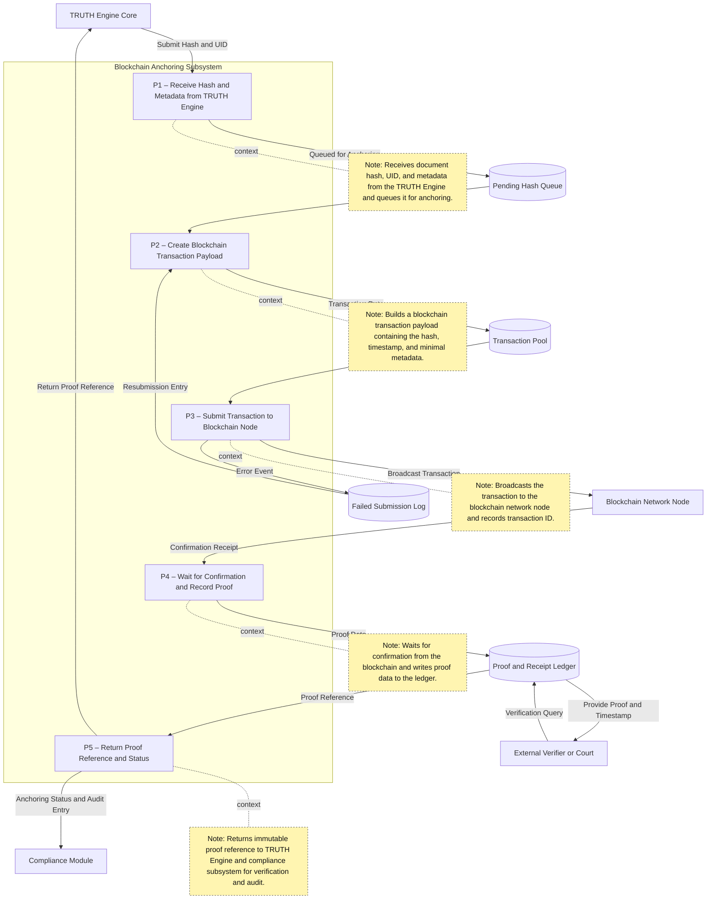
---

### 🧠 Interpretation

| Step | Function | Output / Store |
|------|-----------|----------------|
| **P1** | Accepts document hash and metadata from TRUTH Engine | Pending Hash Queue |
| **P2** | Builds blockchain transaction payload | Transaction Pool |
| **P3** | Broadcasts transaction to blockchain node | Confirmation Receipt |
| **P4** | Waits for confirmation and stores proof | Proof and Receipt Ledger |
| **P5** | Returns immutable proof reference and status | TRUTH Engine / Compliance Module |

---

### ✅ Highlights
- Provides decentralized, tamper-proof evidence of notarization.
- Stores both pending and confirmed states to ensure reliable retries.
- Returns lightweight proof references usable in courts or independent audits.
- Syntax verified: safe for Mermaid v10+, VS Code, GitHub, Obsidian, and Live Editor.

---
# 💸 DFD Level 2 — System Wallet and Clearinghouse Module
## Subsystem of the Electronic Notarization Facility (ENF)
### Process Flow → Collect Fees → Split Funds → Settle Accounts → Record Ledger → Report to Compliance

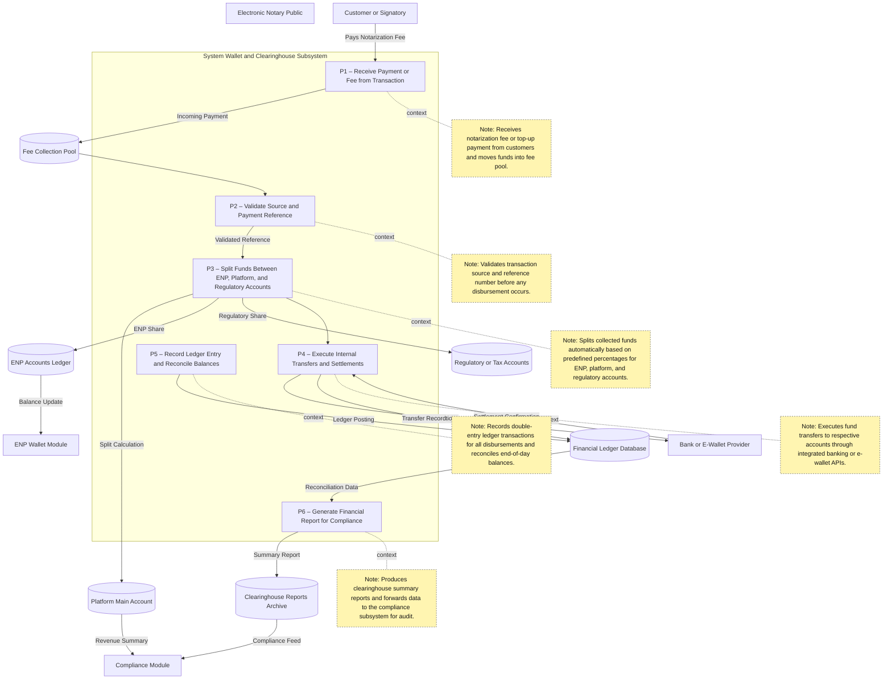
---

### 🧠 Interpretation

| Step | Function | Output / Storage |
|------|-----------|------------------|
| **P1** | Receives notarization payment from customer | Fee Collection Pool |
| **P2** | Validates transaction source and reference | Verified Payment Record |
| **P3** | Calculates revenue shares for ENP, platform, and regulator | Account Entries |
| **P4** | Executes actual fund transfers | Settlement Confirmation |
| **P5** | Records ledger entries and performs reconciliation | Financial Ledger Database |
| **P6** | Generates compliance and tax reporting summaries | Clearinghouse Reports Archive |

---

### ✅ Highlights
- Provides transparent and automated multi-party settlements.
- Maintains real-time wallet balance updates for ENPs.
- Integrates with the banking layer for withdrawals and payouts.
- All financial movements are logged for compliance and auditing.
- Fully Mermaid-v10 validated and safe for IDE or Markdown rendering.

---
# 📬 DFD Level 2 — Notification and Communication Module
## Subsystem of the Electronic Notarization Facility (ENF)
### Process Flow → Trigger Event → Compose Message → Select Channel → Deliver → Log Status → Report

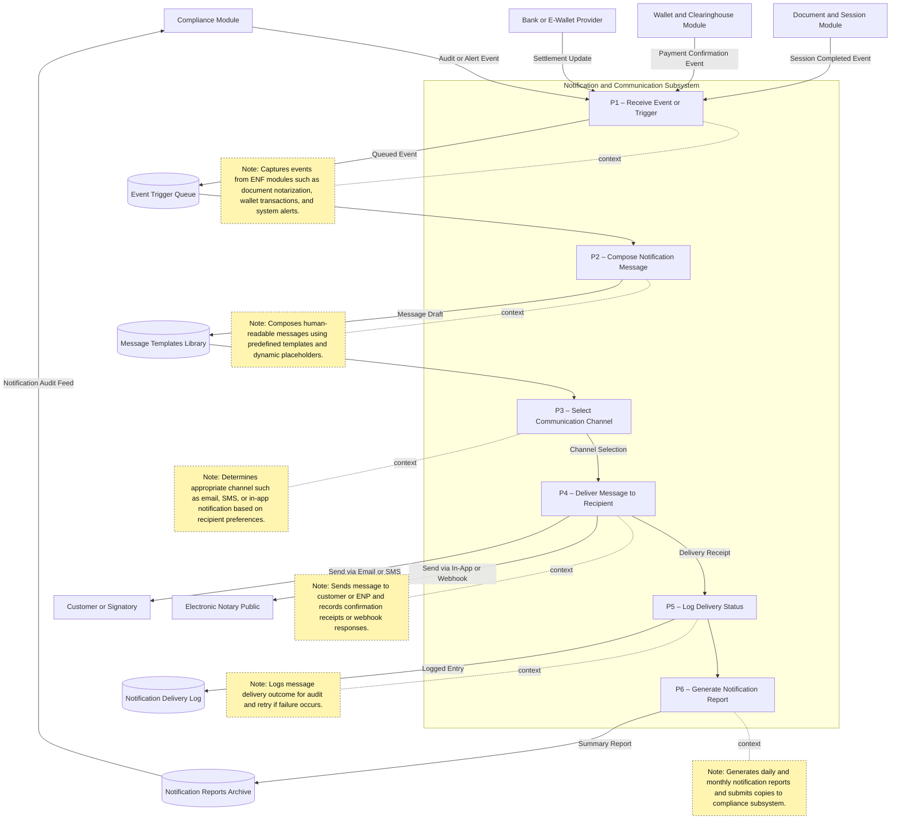
---

### 🧠 Interpretation

| Step | Function | Output / Storage |
|------|-----------|------------------|
| **P1** | Receives system or business event trigger | Event Trigger Queue |
| **P2** | Generates message content using templates | Message Templates Library |
| **P3** | Chooses appropriate communication channel | Channel Selection |
| **P4** | Delivers message to ENP or Customer | Sent Notification |
| **P5** | Logs delivery status and errors | Notification Delivery Log |
| **P6** | Produces notification activity report for Compliance | Notification Reports Archive |

---

### ✅ Highlights
- Integrates with all subsystems (Wallet, Document, Compliance, and Bank).
- Supports omni-channel delivery (email, SMS, in-app, webhook).
- Logs all messages and delivery receipts for traceability.
- Enables retry and audit for failed messages.
- 100% Mermaid syntax validated for Markdown and IDE rendering.

---
# 🔒 DFD Level 2 — Security, Access Control, and Audit Module
## Subsystem of the Electronic Notarization Facility (ENF)
### Process Flow → Authenticate User → Validate Role → Authorize Action → Log Event → Monitor Security

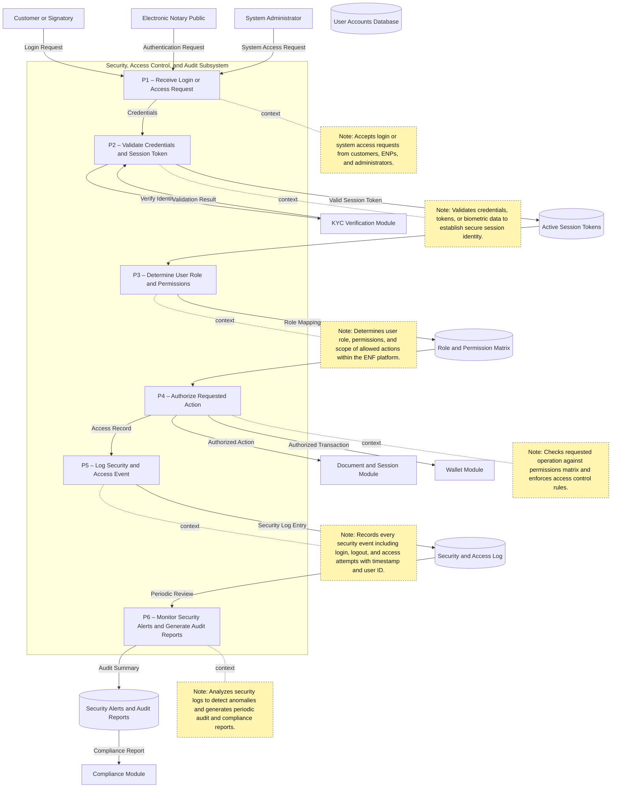
---

### 🧠 Interpretation

| Step | Function | Output / Storage |
|------|-----------|------------------|
| **P1** | Receives user login or access request | User Accounts Database |
| **P2** | Validates credentials, tokens, or biometric input | Active Session Tokens |
| **P3** | Determines role and permissions based on user type | Role and Permission Matrix |
| **P4** | Grants or denies requested action | Authorized Operation |
| **P5** | Logs all security events | Security and Access Log |
| **P6** | Monitors logs, detects anomalies, and generates reports | Security Alerts and Audit Reports |

---

### ✅ Highlights
- Provides **role-based access control** for ENPs, customers, and admins.
- Integrates directly with **KYC** for identity verification and with **Compliance** for reporting.
- Supports **tokenized sessions** and centralized **security log management**.
- Enables **real-time alerting** and audit traceability across modules.
- Syntax verified — safe for Mermaid v10, GitHub, VS Code, and Obsidian.

---
