# 🧑‍⚖️ ENP Review and Identity Checks Explained
## Understanding Dual-Layer Identity Verification in Electronic Notarization

---

## ⚖️ 1️⃣ Legal & Policy Perspective — Why Dual Verification Exists

### 📜 a. Historical Context
Traditionally, the notary’s primary role is to:
- Confirm the **identity** of the signer,
- Ensure the act is **voluntary**, and
- Record it in a **public registry**.

In physical notarization, this involves **checking IDs** and **in-person observation**.

---

### 📜 b. The Need for eKYC in Remote Electronic Notarization (REN)
Under the **Rules on Electronic Notarization (A.M. No. 24-10-14-SC, 2025)**, notaries may perform notarization remotely.  
This introduces risks like impersonation, fake IDs, and deepfakes.

Hence, the **Electronic Notarization Facility (ENF)** must perform **multi-factor identity verification** using eKYC systems before the live session begins.

| Risk | Policy Response |
|------|-----------------|
| Deepfakes or impersonation | Require algorithmic face match (eKYC) |
| Fake or tampered IDs | Require OCR + security feature checks |
| Video manipulation | Require liveness detection |
| ENP’s limited technical ability | Offload verification to ENF system |

This creates a **two-layer verification system**:
1. **Automated system-level verification (eKYC)**, and
2. **Human confirmation by the ENP (video session)**.

---

### ⚙️ c. Layered Trust Model

| Layer | Mechanism | Actor | Purpose |
|-------|------------|--------|----------|
| **1. Automated Verification** | eKYC (OCR, Face Match, Liveness) | ENF System | Establish identity validity |
| **2. Human Confirmation** | Live video session | ENP | Confirm voluntariness, comprehension, and intent |
| **3. Audit & Evidence** | TRUTH Engine + Hash + Video Record | System + ENP | Ensure long-term verifiability |

---

## 👁️ 2️⃣ Practical Perspective — ENP’s Real Role

The ENP is **not a forensic identity expert**. Their role is **behavioral and declarative**, not technical.

| ENP Focus | Observation | Purpose |
|------------|-------------|----------|
| **Voluntariness** | Is the signer acting freely? | Prevent coercion |
| **Awareness** | Does the signer understand the document? | Ensure informed consent |
| **Presence** | Does the signer appear to match their ID? | Diligence |
| **Demeanor** | Any confusion or distress? | Legal safeguard |

Thus, eKYC ensures *who the person is*, while the ENP ensures *what the person is doing and why*.

---

## 🤖 3️⃣ Technological Perspective — Complementary Layers

| Layer | Responsibility | Method |
|--------|----------------|--------|
| **System (ENF)** | Identity proofing | HyperVerge eKYC (OCR, face match, liveness) |
| **ENP** | Voluntariness and understanding | Real-time video interview |
| **TRUTH Engine** | Proof-of-integrity | Canonicalization + hashing + sealing |

### Example Workflow

```
1. Customer performs eKYC → verified identity record created.
2. ENP starts video session → system shows “Verified Identity” badge.
3. ENP visually compares live face with verified photo.
4. ENP confirms intent, awareness, and voluntariness.
5. TRUTH Engine binds identity + behavioral evidence in the notarization record.
```

---

## 🔐 4️⃣ Binding Identity Proof to TRUTH Engine

| Component | Proof Type | Captured By | Stored In |
|------------|-------------|--------------|------------|
| **eKYC Data** | Machine identity (ID, selfie, liveness) | HyperVerge | TRUTH Envelope (metadata) |
| **Video Session** | Behavioral record | ENF Video System | Video archive (linked by UID) |
| **ENP Signature & Seal** | Human attestation | ENP Certificate | TRUTH Envelope |
| **Hash & Blockchain** | Cryptographic integrity | TRUTH Engine | Immutable ledger |

The **TRUTH Envelope** links all these proofs into a single verifiable notarization record.

---

## 🧭 5️⃣ Policy Realism — Is It Overkill?

It may seem redundant, but it’s intentional redundancy.  
This dual layer protects **all parties**:

| Stakeholder | Benefit |
|--------------|----------|
| **ENP** | Relies on eKYC as due diligence proof |
| **Signer** | Protection against impersonation |
| **Court** | Robust evidence chain for disputes |

This is similar to having both a **door lock** and a **security camera** — each reinforces the other.

---

## ⚙️ 6️⃣ Practical ENF Design Pattern

| Component | Description | Role |
|------------|--------------|------|
| **eKYC (Automated)** | ID + selfie + liveness | Base identity proof |
| **ENP Dashboard** | Displays verification badge + portrait | Human judgment aid |
| **Video Session** | WebRTC or Jitsi-based video call | Confirmation of intent |
| **Session Log (TRUTH)** | Hashes, video ref, ENP seal | Forensic record |
| **TRUTH Envelope Output** | Merges identity, video, and hash | Immutable notarization proof |

---

## 🧠 7️⃣ Summary Insight

> **eKYC proves WHO the person is.**  
> **ENP verifies WHAT they are doing and that they MEAN it.**

Together, these make the notarization legally defensible and technologically verifiable.

---

## 🧮 8️⃣ Visual Flow Diagram

```mermaid
flowchart LR
A["User performs eKYC (ID + Selfie + Liveness)"] --> B["ENF verifies identity record"]
B --> C["ENP initiates live video session"]
C --> D["ENP compares user to verified photo"]
D --> E["ENP confirms voluntariness & understanding"]
E --> F["Apply ENP Signature & Seal"]
F --> G["TRUTH Engine binds identity + video + hash"]
G --> H["Notarized Document + TRUTH Envelope"]
H --> I["Delivered to User + Archived for SC"]
```



---

### ✅ Key Takeaway

> The ENP’s identity check is **not redundant** — it is **complementary**.  
> Machine (eKYC) ensures factual identity, while human (ENP) ensures intent and legality.

---

**End of Document**
